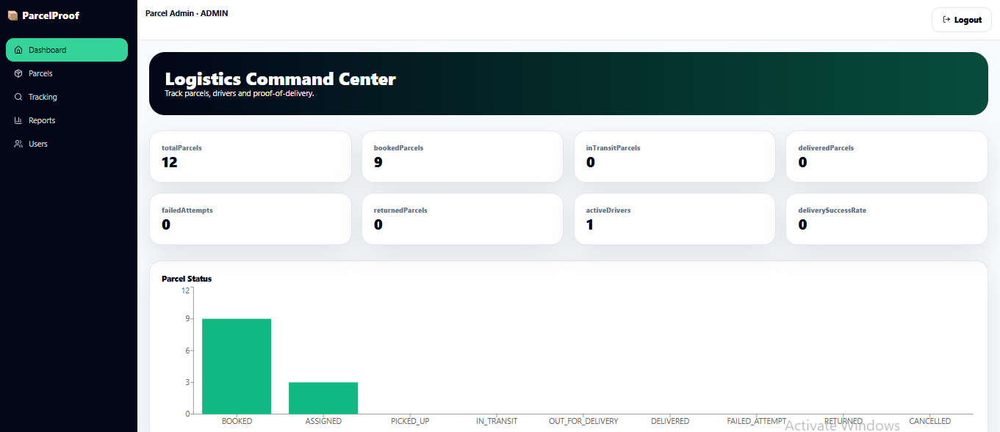

<div align="center">

### 🚚 Courier Delivery & Proof-of-Delivery System


<br/>


<br/>
<br/>


<br/>

### 🚀 Track parcels, assign drivers, verify delivery, and generate proof — all in one premium logistics dashboard.

**ParcelProof** is a full-stack **Spring Boot + PostgreSQL + React** courier delivery management system with parcel booking, driver assignment, OTP proof-of-delivery, failed attempt tracking, public parcel tracking, delivery timelines, CSV reports, SQL views/functions/triggers, JWT security, and a dark green/black premium dashboard UI.


</div>

---

## 📸 Project Preview

<div align="center">

### 📊 Admin Logistics Dashboard



</div>

---

## 🌟 Overview

**ParcelProof** solves a real-world logistics workflow problem. Small courier teams often manage parcel bookings, delivery statuses, driver assignments, failed attempts, and delivery proof using paper sheets, phone calls, WhatsApp messages, or spreadsheets.

ParcelProof provides a professional courier operations system where admins and dispatchers create parcels, assign drivers, drivers update delivery progress, customers track parcels using a tracking code, and OTP demo verification confirms successful delivery.

> ⚠️ **Project Scope:**
> This project is for courier workflow management and educational portfolio use only. OTP, proof photo path, and location notes are demo/local features. It does not connect to real courier networks, SMS gateways, payment gateways, or real GPS services.

---

## 🎯 Real-World Problem & Solution

| 🚨 Problem                                  | ✅ ParcelProof Solution              |
| ------------------------------------------- | ----------------------------------- |
| Parcel status updates are handled manually  | Digital parcel lifecycle tracking   |
| Drivers are assigned through calls/messages | Driver assignment dashboard         |
| Failed deliveries are not properly recorded | Failed attempt history with reasons |
| Customers cannot track safely               | Public tracking code page           |
| Proof-of-delivery is weak                   | OTP demo verification               |
| Reports are hard to prepare                 | CSV reports and dashboard analytics |
| Managers cannot measure driver performance  | Driver performance summary          |

---

## ✨ Key Features

### 📦 Parcel Management

* 📦 Create parcel bookings
* 🔢 Auto-generated tracking code
* 👤 Sender and receiver details
* 🏷️ Parcel type and priority
* 💰 Delivery fee and payment status
* 📅 Pickup and expected delivery dates
* 🚚 Assign parcel to driver
* 🔄 Track parcel status lifecycle

---

### 🚚 Delivery Workflow

Parcel status flow:

```text
BOOKED
   ↓
ASSIGNED
   ↓
PICKED_UP
   ↓
IN_TRANSIT
   ↓
OUT_FOR_DELIVERY
   ↓
DELIVERED
```

Additional statuses:

```text
FAILED_ATTEMPT
RETURNED
CANCELLED
```

---

### 🔐 OTP Proof-of-Delivery Demo

* 🔐 6-digit OTP generated for parcel
* 🚚 Driver must enter OTP to mark parcel delivered
* ✅ Correct OTP confirms delivery
* 🧾 Proof note support
* 🖼️ Proof photo path demo field
* 🕒 Delivery timestamp recorded
* 📌 Timeline event generated automatically

---

### 🚨 Failed Delivery Attempts

* 🚨 Record failed delivery attempts
* 📋 Failure reason selection
* 📝 Notes for driver explanation
* 🔢 Auto-increment attempt number
* 📦 Parcel status updates to `FAILED_ATTEMPT`
* 📊 Failed delivery report support

Failure reasons include:

```text
Customer Not Available
Wrong Address
Phone Not Reachable
Payment Not Ready
Weather Delay
Vehicle Issue
Other
```

---

### 🔎 Public Parcel Tracking

* 🔎 Track parcel using tracking code
* 🛡️ Safe public response
* 🚫 Does not expose sensitive phone/address data
* 📦 Shows parcel status
* 📅 Shows expected delivery date
* 🕒 Shows public delivery timeline
* ✅ Shows proof verification status

---

### 📊 Dashboards & Reports

* 📊 Admin logistics dashboard
* 🚚 Driver dashboard
* 👤 Customer dashboard
* 📈 Parcel status chart
* 🧾 Daily delivery summary
* 🚨 Failed delivery report
* 🚚 Driver performance report
* 💰 Revenue summary
* 📤 CSV export support

---

## 🧠 Advanced Backend Features

| Feature             | Description                                                      |
| ------------------- | ---------------------------------------------------------------- |
| 🔐 JWT Auth         | Secure stateless authentication                                  |
| 🧂 BCrypt           | Password hashing                                                 |
| 👥 Role Access      | Admin, Dispatcher, Driver, Customer                              |
| 🔄 Transactions     | Parcel assignment, status updates, OTP delivery, failed attempts |
| ✅ Validation        | Bean Validation for clean request handling                       |
| 🧾 Audit Logs       | Tracks key delivery actions                                      |
| 🕒 Timeline Events  | Records parcel lifecycle changes                                 |
| 🧱 DTO Layer        | No raw entity exposure                                           |
| 🛡️ Security Config | Role-based protected endpoints                                   |
| 📘 Swagger          | API documentation                                                |

---

## 🗄️ PostgreSQL / SQL Features

| SQL Feature      | Included                                                           |
| ---------------- | ------------------------------------------------------------------ |
| 🗄️ Tables       | Users, parcels, attempts, timeline, audit logs                     |
| 🔗 Relationships | Parcel → Driver, Customer, Timeline, Attempts                      |
| ✅ Constraints    | Unique tracking code, status enums, FK relationships               |
| 📊 Views         | Driver performance, failed delivery report, daily delivery summary |
| ⚙️ Functions     | Tracking code generation, success rate, performance score          |
| 🔁 Triggers      | Timeline insert, audit logs, status tracking                       |
| ⚡ Indexes        | Tracking code, status, driver, expected date                       |

---

## 📌 SQL Views

```text
vw_driver_performance
vw_failed_delivery_report
vw_daily_delivery_summary
vw_parcel_status_summary
vw_unassigned_parcels
vw_delayed_parcels
vw_revenue_summary
```

---

## ⚙️ SQL Functions

```text
generate_tracking_code()
calculate_driver_success_rate(driver_id)
calculate_driver_performance_score(driver_id)
get_daily_delivery_count(date)
get_failed_attempt_count(driver_id, start_date, end_date)
```

---

## 🔁 SQL Triggers

```text
parcel_insert_timeline
parcel_status_timeline
delivery_attempt_audit
```

---

## 👥 User Roles

| Role          | Access                                                                   |
| ------------- | ------------------------------------------------------------------------ |
| 👑 Admin      | Manage users, parcels, drivers, reports, audit logs                      |
| 🧭 Dispatcher | Create parcels, assign drivers, monitor delivery workflow                |
| 🚚 Driver     | View assigned parcels, update status, verify OTP, record failed attempts |
| 👤 Customer   | View own parcels and track delivery status                               |

---

## 🧰 Tech Stack

| Layer         | Technology                   |
| ------------- | ---------------------------- |
| ☕ Backend     | Java 17, Spring Boot 3       |
| 🔐 Security   | Spring Security, JWT, BCrypt |
| 🗄️ Database  | PostgreSQL                   |
| 🧩 ORM        | Spring Data JPA, Hibernate   |
| ✅ Validation  | Bean Validation              |
| 📘 API Docs   | Swagger / OpenAPI            |
| ⚛️ Frontend   | React + Vite                 |
| 🎨 Styling    | Tailwind CSS                 |
| 🧭 Routing    | React Router                 |
| 🔗 API Client | Axios                        |
| 📊 Charts     | Recharts                     |
| 🎯 Icons      | Lucide React                 |
| 🔔 Toasts     | React Toastify               |
| 🐳 Runtime    | Docker Compose               |

---

## 🎨 UI Theme

ParcelProof uses a **premium dark green + black logistics dashboard theme**.

| Color Role            | Hex       |
| --------------------- | --------- |
| Deep Black            | `#020617` |
| Charcoal Black        | `#0B1120` |
| Dark Green            | `#064E3B` |
| Primary Green         | `#047857` |
| Emerald Green         | `#10B981` |
| Neon Green Accent     | `#22C55E` |
| Soft Green Background | `#ECFDF5` |
| Lime Accent           | `#A3E635` |
| Danger Red            | `#DC2626` |
| Warning Amber         | `#F59E0B` |

---

## 🏗️ System Architecture

```text
┌────────────────────────────────────┐
│          React Frontend             │
│   Vite + Tailwind + Recharts UI     │
└──────────────────┬─────────────────┘
                   │
                   │ REST API + JWT
                   ▼
┌────────────────────────────────────┐
│        Spring Boot Backend          │
│ Security + Services + Reports APIs  │
└──────────────────┬─────────────────┘
                   │
                   │ Spring Data JPA
                   ▼
┌────────────────────────────────────┐
│           PostgreSQL DB             │
│ Tables + Views + Functions + Triggers│
└────────────────────────────────────┘
```

---

## 🗄️ Database Schema Summary

### 👤 `users`

```text
id
full_name
email
password
role
phone
address
status
vehicle_number
vehicle_type
license_number
availability_status
created_at
updated_at
```

### 📦 `parcels`

```text
id
tracking_code
sender_name
sender_phone
sender_address
receiver_name
receiver_phone
receiver_address
receiver_city
parcel_type
weight
delivery_fee
payment_status
priority
status
assigned_driver_id
customer_id
pickup_date
expected_delivery_date
delivered_at
delivery_otp
otp_verified
proof_note
proof_photo_path
created_at
updated_at
```

### 🚨 `delivery_attempts`

```text
id
parcel_id
driver_id
attempt_number
attempt_status
failure_reason
notes
proof_photo_path
otp_verified
attempted_at
```

### 🕒 `parcel_timeline`

```text
id
parcel_id
status
description
updated_by_id
location_note
public_visible
created_at
```

### 🧾 `audit_logs`

```text
id
user_id
action
entity_type
entity_id
description
created_at
```

---

## 🔌 API Endpoints

### 🔐 Auth

```text
POST /api/auth/register
POST /api/auth/login
GET  /api/auth/me
```

### 👥 Users

```text
GET /api/users
GET /api/users/drivers
GET /api/users/customers
PUT /api/users/{id}/status
```

### 📦 Parcels

```text
POST /api/parcels
GET  /api/parcels
GET  /api/parcels/{id}
GET  /api/parcels/tracking/{trackingCode}
PUT  /api/parcels/{id}/assign-driver
PUT  /api/parcels/{id}/status
PUT  /api/parcels/{id}/cancel
PUT  /api/parcels/{id}/return
GET  /api/parcels/{id}/timeline
```

### 🚚 Driver

```text
GET  /api/driver/dashboard
GET  /api/driver/parcels
GET  /api/driver/route
PUT  /api/driver/parcels/{id}/pickup
PUT  /api/driver/parcels/{id}/in-transit
PUT  /api/driver/parcels/{id}/out-for-delivery
POST /api/driver/parcels/{id}/verify-delivery
POST /api/driver/parcels/{id}/failed-attempt
```

### 🔎 Public Tracking

```text
GET /api/tracking/{trackingCode}
GET /api/tracking/{trackingCode}/timeline
```

### 📊 Dashboard

```text
GET /api/dashboard/admin
GET /api/dashboard/dispatcher
GET /api/dashboard/customer
```

### 📤 Reports

```text
GET /api/reports/daily-deliveries
GET /api/reports/failed-deliveries
GET /api/reports/driver-performance
GET /api/reports/parcel-status
GET /api/reports/revenue
GET /api/reports/export/csv
```

---

## ✅ Validation Features

### 🔐 Register Validation

* ✅ Full name required
* ✅ Email required
* ✅ Valid email format
* ✅ Unique email
* ✅ Password min 8 characters
* ✅ Password must include uppercase, lowercase, and number
* ✅ Role defaults safely

### 📦 Parcel Validation

* ✅ Sender name required
* ✅ Sender phone required
* ✅ Sender address required
* ✅ Receiver name required
* ✅ Receiver phone required
* ✅ Receiver address required
* ✅ Receiver city required
* ✅ Parcel type required
* ✅ Weight must be greater than 0
* ✅ Delivery fee cannot be negative
* ✅ Priority required
* ✅ Expected delivery date required
* ✅ Expected delivery date cannot be before pickup date

### 🚚 Driver Assignment Validation

* ✅ Parcel must exist
* ✅ Driver must exist
* ✅ Driver must have DRIVER role
* ✅ Driver must be active
* ✅ Cannot assign delivered/cancelled parcels
* ✅ Timeline event created
* ✅ Audit log created

### 🔐 OTP Delivery Validation

* ✅ OTP required
* ✅ OTP must be 6 digits
* ✅ OTP must match parcel OTP
* ✅ Driver can verify only assigned parcels
* ✅ Delivered timestamp recorded
* ✅ Successful delivery attempt created

### 🚨 Failed Attempt Validation

* ✅ Failure reason required
* ✅ Notes max length checked
* ✅ Driver can fail only assigned parcels
* ✅ Attempt number auto calculated
* ✅ Parcel status updated
* ✅ Timeline event created

---

## 🛡️ Security Features

* 🔐 JWT authentication
* 🔒 BCrypt password hashing
* 👥 Role-based endpoint protection
* 🛡️ Spring Security
* 🌐 CORS configuration
* 🚫 Password hidden from responses
* 🧱 DTO-based API responses
* ✅ Bean Validation
* 🧼 Clean global error handling
* 🔎 Safe public tracking endpoint
* 🚚 Driver ownership validation
* 👤 Customer ownership validation

---

## 📁 Folder Structure

```text
parcelproof-courier-delivery-proof-system/
├── backend/
│   ├── src/main/java/com/parcelproof/
│   │   ├── ParcelProofApplication.java
│   │   ├── config/
│   │   ├── controller/
│   │   ├── dto/
│   │   ├── entity/
│   │   ├── enums/
│   │   ├── exception/
│   │   ├── mapper/
│   │   ├── repository/
│   │   ├── security/
│   │   ├── service/
│   │   └── util/
│   ├── src/main/resources/
│   ├── src/test/java/com/parcelproof/
│   ├── pom.xml
│   └── README.md
│
├── frontend/
│   ├── src/
│   │   ├── assets/images/
│   │   ├── components/
│   │   ├── context/
│   │   ├── layouts/
│   │   ├── pages/
│   │   ├── services/
│   │   ├── utils/
│   │   ├── App.jsx
│   │   ├── main.jsx
│   │   └── index.css
│   ├── package.json
│   ├── .env.example
│   ├── index.html
│   └── vite.config.js
│
├── database/
│   ├── schema.sql
│   ├── views.sql
│   ├── functions.sql
│   ├── triggers.sql
│   ├── seed.sql
│   └── reports.sql
│
├── docs/
│   ├── API_DOCUMENTATION.md
│   ├── DATABASE_SCHEMA.md
│   ├── SQL_FEATURES.md
│   ├── SYSTEM_ARCHITECTURE.md
│   ├── SECURITY_DESIGN.md
│   └── VALIDATION_RULES.md
│
├── screenshots/
│   └── Dashboard.PNG
│
├── docker-compose.yml
├── README.md
└── .gitignore
```

---

## ⚙️ Run Locally

### 1️⃣ Start PostgreSQL

```bash
docker compose up -d postgres
```

---

### 2️⃣ Start Backend

```bash
cd backend
mvn clean install
copy src\main\resources\application-example.properties src\main\resources\application.properties
mvn spring-boot:run
```

Backend URL:

```text
http://localhost:8080
```

Swagger URL:

```text
http://localhost:8080/swagger-ui/index.html
```

---

### 3️⃣ Start Frontend

```bash
cd frontend
npm install
copy .env.example .env
npm run dev
```

Frontend URL:

```text
http://localhost:5173
```

---

## 🔑 Demo Accounts

```text
Admin
Email:    admin@example.com
Password: Admin12345

Dispatcher
Email:    dispatcher@example.com
Password: Dispatcher12345

Driver
Email:    driver@example.com
Password: Driver12345

Customer
Email:    customer@example.com
Password: Customer12345
```

---

## 🧪 Test Flow

### 👑 Admin / Dispatcher Flow

```text
1. Login as admin or dispatcher
2. Create parcel booking
3. Assign driver
4. Monitor parcel status
5. View reports
6. Export CSV
```

### 🚚 Driver Flow

```text
1. Login as driver
2. View assigned parcels
3. Mark pickup
4. Mark in transit
5. Mark out for delivery
6. Enter OTP and verify delivery
7. Record failed attempt if needed
```

### 👤 Customer Flow

```text
1. Login as customer
2. View own parcels
3. Track parcel status
4. View delivery proof status
```

### 🔎 Public Tracking Flow

```text
1. Open tracking page
2. Enter tracking code
3. View safe public parcel status
4. View delivery timeline
```

---

## 🚀 Future Improvements

* 📲 Real SMS OTP integration
* 📍 Real GPS tracking with consent
* 📱 Driver mobile app
* 👤 Customer notification emails
* 🔔 Push notifications
* 🧭 Route optimization
* 📷 Barcode / QR scanning
* 🖼️ Cloud photo proof upload
* 📄 PDF delivery reports
* 🏢 Multi-branch courier company support
* 💳 Payment collection workflow
* ⚡ Real-time WebSocket tracking
* ☁️ Cloud deployment
* 🔁 CI/CD pipeline

---

## 👨‍💻 Author

<div align="center">

**Lithira Liyanage**
Full Stack Developer | Spring Boot Developer | SQL Developer | MERN Stack Developer | AI Engineer

[](https://github.com/LithiraLiyanage)
[](https://www.linkedin.com/in/lithira-liyanage-667b99403)
[](https://lithira-liyanage.vercel.app/)

</div>

---

<div align="center">

### ⭐ If this project helps you, give it a star!


<br/>


</div>
